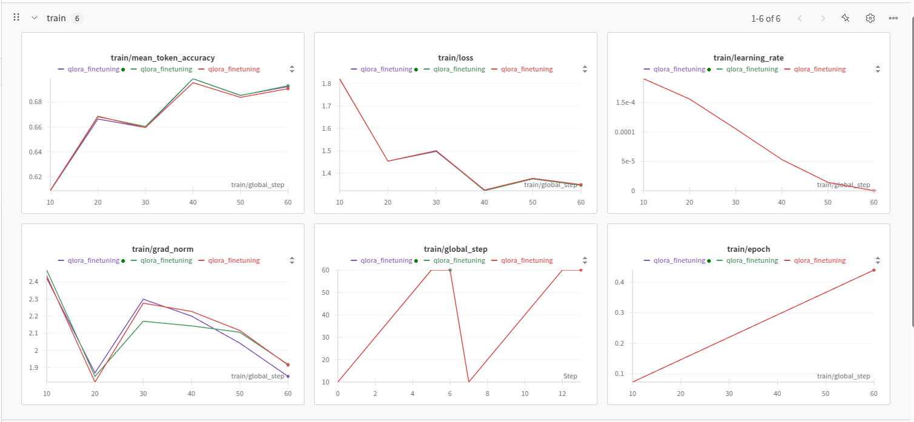
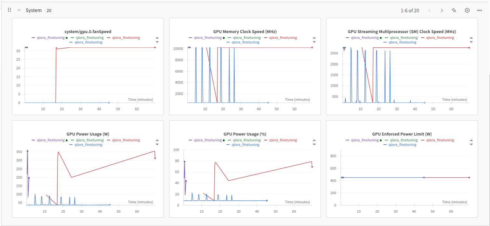

# Mistral-7B 금융 데이터 파인튜닝 프로젝트

이 저장소는 Mistral-7B-v0.1 언어모델을 국내 금융 QA 데이터셋으로 파인튜닝하는 전체 실습 예제입니다. Huggingface Transformers, PEFT(QLoRA), Weights & Biases(WandB) 등 최신 라이브러리와 도구를 활용합니다.

## 폴더 구조

```
fine_tune/
├── data/
│   └── Non-life_insurance_Dataset.csv   # 금융 QA 데이터셋 (질문-답변, 카테고리)
├── images/
│   ├── train_metrics.png                # 학습 과정 시각화(손실, 정확도 등)
│   └── system_monitoring.png            # GPU 등 시스템 모니터링 그래프
├── models/
│   └── Mistral-7B-Finetuned/            # 파인튜닝된 모델 및 체크포인트
├── wandb/                               # WandB 실험 추적 로그
├── mistral_finetune.ipynb               # 전체 파인튜닝 실습 노트북
└── env.yml                              # 재현 가능한 Conda 환경설정 파일
```

## 주요 파일 설명

- **mistral_finetune.ipynb**  
  Mistral-7B 모델을 금융 QA 데이터로 파인튜닝하는 전체 코드와 설명이 포함된 Jupyter 노트북입니다. 데이터 로드, 전처리, 모델 로딩, LoRA 적용, 학습, 저장, 테스트, 결과 분석까지 전 과정을 다룹니다.

- **env.yml**  
  실습에 필요한 Python 및 주요 라이브러리(Transformers, PEFT, bitsandbytes, trl, wandb 등)가 명시된 Conda 환경 파일입니다.

- **data/Non-life_insurance_Dataset.csv**  
  질문-답변(Question-Answer) 쌍과 카테고리로 구성된 금융 특화 QA 데이터셋입니다.  
  - 주요 컬럼: `QA_text`(질문과 답변이 하나의 문자열로 결합), `Category`(질문 분류)

- **models/Mistral-7B-Finetuned/**  
  파인튜닝된 LoRA 어댑터, 토크나이저, 체크포인트, 학습 설정 등이 저장됩니다.

- **images/**  
  학습 과정 및 시스템 모니터링 결과를 시각화한 이미지가 저장됩니다.

- **wandb/**  
  실험 추적 및 로깅을 위한 WandB 관련 파일과 폴더입니다.

## 환경설정 및 실행 방법

1. **Conda 환경 생성**
   ```bash
   conda env create -f env.yml
   conda activate finetune_venv
   ```

2. **Jupyter 노트북 실행**
   ```bash
   jupyter notebook
   ```
   - `mistral_finetune.ipynb`를 열어 셀을 순서대로 실행하세요.

3. **Huggingface & WandB 로그인**
   - Huggingface: `!huggingface-cli login`
   - WandB: `!wandb login` 또는 노트북 내에서 `wandb.login()` 실행

4. **파인튜닝 및 결과 확인**
   - 학습 과정, 손실 곡선, GPU 사용량 등은 WandB 대시보드와 `images/` 폴더의 그래프에서 확인할 수 있습니다.

## 데이터셋 예시

| QA_text | Category |
|---------|----------|
| "##Question: 골프보험 알려줘? ##Answer: 골프장에서의 사고를 대상으로, ... " | 장기보험-물건,사물 |
| "##Question: 선물이 뭐야? ##Answer: 파생상품의 한 종류로서 ... " | 증권용어 |

## 결과 시각화

- 
- 

## 참고사항

- 본 프로젝트는 로컬 GPU 환경(CUDA 11.8 이상)에서 실행하는 것을 권장합니다.
- 데이터 및 모델, WandB 로그 등은 용량이 크므로 관리에 유의하세요.
- 추가 실험을 원할 경우, learning_rate, batch_size, gradient_accumulation_steps 등 하이퍼파라미터를 조정해보세요.

## 참고문서

- [Mistral-7B 모델](https://huggingface.co/mistralai/Mistral-7B-v0.1)
- [도메인 특화 LLM: Mistral 7B를 활용한 금융 업무분야 파인튜닝 및 활용 방법 (정천수)](https://huggingface.co/datasets/csujeong/Non_life_insurance)
- [Huggingface Transformers](https://huggingface.co/docs/transformers/index)
- [PEFT/QLoRA](https://github.com/huggingface/peft)
- [Weights & Biases](https://wandb.ai/) 